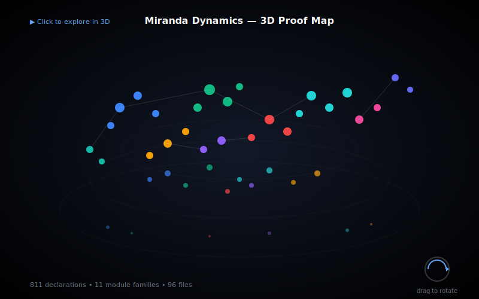

<sub><strong>Our tech stack is ontological:</strong><br>
<strong>Hardware — Physics</strong><br>
<strong>Software — Mathematics</strong><br><br>
<strong>Our engineering workflow is simple:</strong> discover, build, grow, learn & teach</sub>

---

<sub>
<strong>Notice of Proprietary Information</strong><br>
This document outlines foundational concepts and methodologies developed during internal research and development at Apoth3osis. To protect our intellectual property and adhere to client confidentiality agreements, the code, architectural details, and performance metrics presented herein may be simplified, redacted, or presented for illustrative purposes only. This paper is intended to share our conceptual approach and does not represent the full complexity, scope, or performance of our production-level systems. The complete implementation and its derivatives remain proprietary.
</sub>

---

# Miranda Dynamics: Formal Verification of Computational Universality in Dynamical Systems

[](https://lean-lang.org)
[](https://github.com/leanprover-community/mathlib4)
[](RESEARCHER_BUNDLE/HeytingLean/MirandaDynamics/)
[](LICENSE)

## Credo

> *"The problem of reducing all of mechanics to the study of billiards is of such basic importance that it seems worthwhile to draw the attention of mathematicians to it."*
> — **Yakov Sinai**, *Dynamical Systems with Elastic Reflections* (1970)

> *"Any sufficiently smooth dynamical system can simulate any Turing machine."*
> — **Eva Miranda**, on the computational universality of contact flows (2025)

### Acknowledgment

This formalization honors the groundbreaking work of **Professor Eva Miranda** (Universitat Politècnica de Catalunya) and her collaborators, who have established profound connections between dynamical systems and computation theory. Their results demonstrate that classical physical systems—billiards, fluid flows, contact dynamics—are not merely mechanical curiosities but fundamental models of computation, equivalent in power to universal Turing machines. This formalization would not exist without their mathematical vision.

We humbly thank the collective intelligence of humanity for providing the technology and culture we cherish. We do our best to properly reference the authors of the works utilized herein, though we may occasionally fall short. Our formalization acts as a reciprocal validation—confirming the structural integrity of their original insights while securing the foundation upon which we build. In truth, all creative work is derivative; we stand on the shoulders of those who came before, and our contributions are simply the next link in an unbroken chain of human ingenuity.

---

**Machine-checked formalization of computational universality in dynamical systems**, based on the TKFT (Topological Kleene Field Theory) framework and Miranda's results on billiards, Euler flows, and Navier-Stokes equations as universal computers.

## Primary Research Papers Formalized

| Paper | Authors | Year | DOI/arXiv |
|-------|---------|------|-----------|
| **"Classical billiards can compute"** | Eva Miranda, Daniel Ramos | 2025 | [arXiv:2512.19156](https://arxiv.org/abs/2512.19156) |
| **"Topological Kleene Field Theories as a model of computation"** | Ángel González-Prieto, Eva Miranda, Daniel Peralta-Salas | 2025 | [arXiv:2503.16100](https://arxiv.org/abs/2503.16100) |
| **"Constructing Turing complete Euler flows in dimension 3"** | Robert Cardona, Eva Miranda, Daniel Peralta-Salas, Francisco Presas | 2021 | [PNAS 10.1073/pnas.2026818118](https://doi.org/10.1073/pnas.2026818118) |
| **"Turing complete Navier-Stokes steady states via cosymplectic geometry"** | Sophie Dyhr, Ángel González-Prieto, Eva Miranda, Daniel Peralta-Salas | 2025 | [arXiv:2507.07696](https://arxiv.org/abs/2507.07696) |
| **"Universality of Euler flows and flexibility of Reeb embeddings"** | Robert Cardona, Eva Miranda, Daniel Peralta-Salas, Francisco Presas | 2019 | [arXiv:1911.01963](https://arxiv.org/abs/1911.01963) |

---

## What This Formalization Proves

### Fully Mechanized (No Axioms, No `sorry`)

| Result | Location | Description |
|--------|----------|-------------|
| **TKFT Reaching Relations** | `TKFT/Reaching.lean` | Categorical structure of reachability-based computation |
| **Mathlib Flow Integration** | `TKFT/FlowReaching.lean` | Reaching relations induced by Mathlib `Flow` objects |
| **RelCat Equivalence** | `TKFT/RelCatBridge.lean` | `TKFT.Obj ≌ CategoryTheory.RelCat` |
| **Cantor Tape Encoding** | `Billiards/CantorEncoding.lean` | `encodeTape_injective`: Turing tape → ternary Cantor set |
| **Halting ↔ Periodic** | `Discrete/HaltingToPeriodic.lean` | `reachesPeriod2_iff_halts`: halting reduces to period-2 orbits |
| **Union Nucleus** | `FixedPoint/PeriodicNucleus.lean` | Fixed-point characterization forming Heyting algebras |
| **Undecidability Transfer** | `Undecidability/Transfers.lean` | Generic halting problem reductions |
| **Bordism Semantics** | `TKFT/BordismSemantics.lean` | Compositional semantics via discrete bordisms |

### External Claims (Interfaces, Not Axioms)

These results from the Miranda papers are represented as **type structures** that make explicit what properties we assume from the geometric content. No `axiom` declarations are used.

| Claim | Interface | Source Paper |
|-------|-----------|--------------|
| Billiards compute | `BilliardsComputesClaim` | Miranda-Ramos 2025 |
| Euler Turing-complete | `EulerTuringCompleteClaim` | Cardona et al. 2021 |
| Navier-Stokes Turing-complete | `NavierStokesTuringCompleteClaim` | Dyhr et al. 2025 |

---

## Module Structure

```
HeytingLean/MirandaDynamics/
├── TKFT/                    # Topological Kleene Field Theory
│   ├── Reaching.lean        # Abstract reaching relations
│   ├── Category.lean        # Reaching as morphisms
│   ├── FlowReaching.lean    # Mathlib Flow integration
│   ├── RelCatBridge.lean    # RelCat equivalence
│   ├── BordismSemantics.lean
│   └── DiscreteBordism.lean
├── Billiards/               # Miranda-Ramos billiard computation
│   ├── CantorEncoding.lean  # Tape → Cantor encoding (mechanized)
│   ├── CantorNucleus.lean   # Closure operators on Cantor sets
│   ├── Geometry.lean        # Reflection laws (staged)
│   ├── PaperMap*.lean       # Piecewise-affine constructions
│   └── ...                  # 59 files total
├── Computation/             # Flow realization
│   ├── TuringMachine.lean
│   ├── FlowRealization.lean
│   └── GeneralizedShift*.lean
├── Discrete/                # Halting ↔ periodic bridges
│   ├── HaltingToPeriodic.lean
│   ├── FlowBridge.lean
│   └── GeneralizedShiftBridge.lean
├── FixedPoint/              # Nucleus operators
│   └── PeriodicNucleus.lean
├── HeytingTuring/           # Heyting-Turing correspondence
│   └── Correspondence.lean
├── Undecidability/          # Reduction machinery
│   └── Transfers.lean
├── External/                # Literature claim interfaces
│   ├── Interfaces.lean
│   ├── Claims.lean
│   └── Consequences.lean
├── Fluids/                  # Contact linear structures
│   └── ContactLinear*.lean
└── Geometry/                # Differential forms
    └── Contact/, Forms/
```

---

## Key Theorems

### 1. Cantor Tape Encoding (Miranda-Ramos)

```lean
theorem encodeTape_injective : Function.Injective encodeTape
```

Maps bi-infinite binary Turing machine tapes to the ternary Cantor set, preserving the symbolic dynamics structure required for billiard simulation.

### 2. Halting ↔ Periodic Orbit

```lean
theorem reachesPeriod2_iff_halts (tm : TuringMachine) (cfg : Config) :
    tm.reachesPeriod2 cfg ↔ tm.halts cfg
```

A Turing machine halts if and only if its corresponding dynamical system reaches a period-2 orbit. This is the key bridge between computation and dynamics.

### 3. TKFT Categorical Structure

```lean
theorem ReachingRel.assoc : (r ∘ᵣ s) ∘ᵣ t = r ∘ᵣ (s ∘ᵣ t)
theorem ReachingRel.id_left : id ∘ᵣ r = r
```

Reaching relations form a category, enabling compositional reasoning about computational paths.

### 4. Undecidability Transfer

```lean
theorem not_computable_of_reduces {P Q : ℕ → Prop}
    (hQ : ¬Computable Q) (hred : Reduces P Q) : ¬Computable P
```

If a predicate reduces to an uncomputable one, it is itself uncomputable—enabling transfer of halting problem undecidability to dynamical predicates.

---

## Interactive Visualizations

Explore the proof structure through interactive visualizations:

<table>
<tr>
<td align="center" width="50%">
<a href="https://abraxas1010.github.io/miranda-dynamics-lean/RESEARCHER_BUNDLE/artifacts/visuals/miranda_2d.html">

</a>
<br><strong>2D UMAP Proof Space</strong><br>
<sub>Semantic clustering of 65+ theorems by module family</sub>
</td>
<td align="center" width="50%">
<a href="https://abraxas1010.github.io/miranda-dynamics-lean/RESEARCHER_BUNDLE/artifacts/visuals/miranda_3d.html">

</a>
<br><strong>3D UMAP Proof Space</strong><br>
<sub>Three-dimensional exploration with auto-rotation</sub>
</td>
</tr>
<tr>
<td align="center" width="50%">
<a href="https://abraxas1010.github.io/miranda-dynamics-lean/RESEARCHER_BUNDLE/artifacts/visuals/tactic_flow.html">

</a>
<br><strong>Tactic Flow Graphs</strong><br>
<sub>Step-by-step visualization of proof tactics</sub>
</td>
<td align="center" width="50%">
<a href="https://abraxas1010.github.io/miranda-dynamics-lean/RESEARCHER_BUNDLE/artifacts/visuals/proof_term_dag.html">

</a>
<br><strong>Proof Term DAGs</strong><br>
<sub>Lambda calculus AST structure of proof terms</sub>
</td>
</tr>
</table>

**[View All Visualizations →](https://abraxas1010.github.io/miranda-dynamics-lean/RESEARCHER_BUNDLE/artifacts/visuals/)**

---

## Verification

```bash
cd RESEARCHER_BUNDLE
lake build --wfail

# Verify zero sorries
grep -r "sorry" HeytingLean/MirandaDynamics/ && echo "FAIL: sorries found" || echo "PASS: no sorries"
```

---

## The Miranda Computation Thesis

Professor Miranda's research program establishes a remarkable thesis:

> **Physical dynamics = Universal computation**

Specifically:
1. **Billiards** (Miranda-Ramos): A particle bouncing in a polygonal table can simulate any Turing machine via Cantor encoding of the tape.
2. **Euler flows** (Cardona-Miranda-Peralta-Presas): Steady solutions to the 3D Euler equations on S³ are Turing-complete.
3. **Navier-Stokes** (Dyhr-González-Miranda-Peralta): Viscosity does NOT obstruct computational universality—steady NS solutions remain Turing-complete.
4. **TKFT** (González-Miranda-Peralta): Topological field theories provide a categorical framework unifying these results.

This formalization mechanizes the **algebraic and categorical spine** of these results, while the geometric content (contact geometry, Beltrami fields, billiard table constructions) is represented via explicit interfaces.

---

## Ongoing Work

The following aspects are actively being formalized (see `WIP/` directory):

- **WS7.3**: Complete billiard table geometry (global return map, collision cross-sections)
- **WS7.4**: GenShift-to-billiard glue (geometric decode functions)
- **WS5+**: Reeb-Beltrami correspondence for Euler flow universality

---

## References

### Primary Sources (Miranda et al.)

1. Miranda, E., & Ramos, D. (2025). *Classical billiards can compute*. arXiv:2512.19156
2. González-Prieto, Á., Miranda, E., & Peralta-Salas, D. (2025). *Topological Kleene Field Theories as a model of computation*. arXiv:2503.16100
3. Cardona, R., Miranda, E., Peralta-Salas, D., & Presas, F. (2021). *Constructing Turing complete Euler flows in dimension 3*. PNAS, 118(19).
4. Dyhr, S., González-Prieto, Á., Miranda, E., & Peralta-Salas, D. (2025). *Turing complete Navier-Stokes steady states via cosymplectic geometry*. arXiv:2507.07696
5. Cardona, R., Miranda, E., Peralta-Salas, D., & Presas, F. (2019). *Universality of Euler flows and flexibility of Reeb embeddings*. arXiv:1911.01963

### Foundational Theory

- Kleene, S.C. (1945). *On the interpretation of intuitionistic number theory*. Journal of Symbolic Logic.
- Johnstone, P.T. (1982). *Stone Spaces*. Cambridge University Press. (Frame theory, nucleus operators)
- Sinai, Ya.G. (1970). *Dynamical systems with elastic reflections*. Russian Mathematical Surveys.

---

## License

MIT License - See [LICENSE](LICENSE)

---

<sub>Part of the **HeytingLean** formalization project • [apoth3osis.io](https://apoth3osis.io)</sub>
