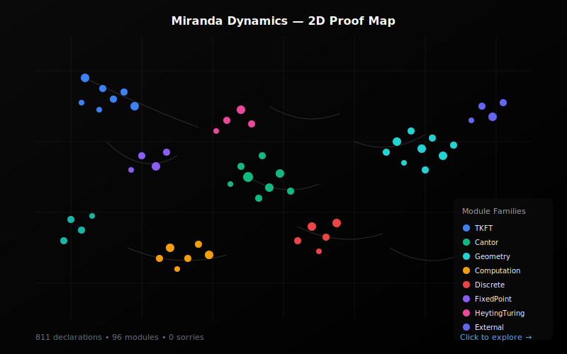
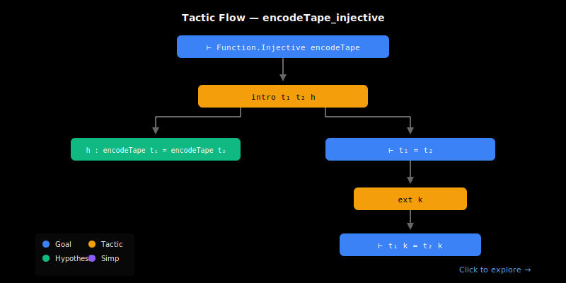
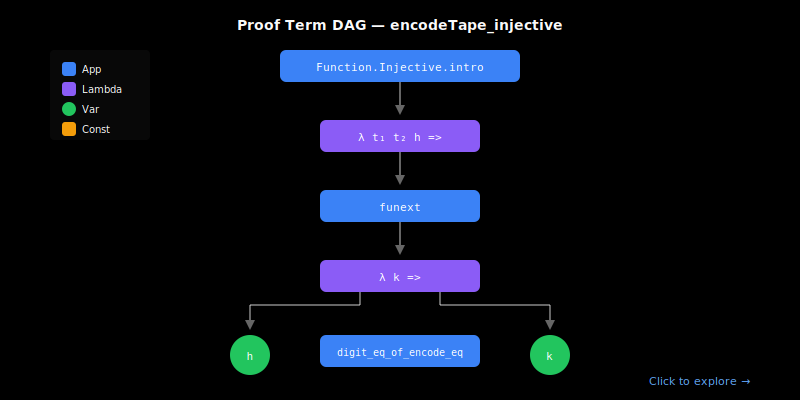

<sub><strong>Our tech stack is ontological:</strong><br>
<strong>Hardware — Physics</strong><br>
<strong>Software — Mathematics</strong><br><br>
<strong>Our engineering workflow is simple:</strong> discover, build, grow, learn & teach</sub>

---

<sub>
<strong>Notice of Proprietary Information</strong><br>
This document outlines foundational concepts and methodologies developed during internal research and development at Apoth3osis. To protect our intellectual property and adhere to client confidentiality agreements, the code, architectural details, and performance metrics presented herein may be simplified, redacted, or presented for illustrative purposes only. This paper is intended to share our conceptual approach and does not represent the full complexity, scope, or performance of our production-level systems. The complete implementation and its derivatives remain proprietary.
</sub>

---

# Miranda Dynamics

**What physics, computation, and logic have in common — machine‑verified and empirically validated**

[](https://lean-lang.org)
[](https://github.com/leanprover-community/mathlib4)
[](RESEARCHER_BUNDLE/HeytingLean/MirandaDynamics/)
[](LICENSE.md)
[](https://abraxas1010.github.io/miranda-dynamics-lean/visualization/)

## Credo

> *"The book of nature is written in the language of mathematics."*
> — **Galileo Galilei**

This repository formalizes a remarkable convergence: three independent research programs discovered they were studying the same mathematical structure. We provide machine-checked proofs in Lean 4 with empirical validation against real seismic data.

### Acknowledgment

We humbly thank the collective intelligence of humanity for providing the technology and culture we cherish. We do our best to properly reference the authors of the works utilized herein, though we may occasionally fall short. Our formalization acts as a reciprocal validation—confirming the structural integrity of their original insights while securing the foundation upon which we build. In truth, all creative work is derivative; we stand on the shoulders of those who came before, and our contributions are simply the next link in an unbroken chain of human ingenuity.

---

# Part I: Miranda's Dynamical Systems

## The TKFT Framework

Eva Miranda and collaborators (Barcelona) developed the **Topological Kleene Field Theory (TKFT)** framework, establishing a profound connection between dynamical systems and computation.

### The Central Insight

> *"Any smooth dynamical system can compute anything."*

Miranda showed that physical systems — billiard balls bouncing in enclosures, fluids flowing through channels, particles moving through phase space — can perform arbitrary computation. The key structure is the **reaching relation**: given a dynamical system, which states can evolve to reach other states?

### The Reaching Relation

In TKFT, the fundamental object is a relation `Reaches(x, y)` meaning "state x can evolve to state y under the dynamics." This relation has categorical structure:

```lean
structure ReachingRel (α : Type u) (β : Type v) : Type (max u v) where
  rel : α → β → Prop

def comp (R : ReachingRel α β) (S : ReachingRel β γ) : ReachingRel α γ :=
  ⟨fun a c => ∃ b, R.rel a b ∧ S.rel b c⟩
```

Reaching relations compose associatively and have identity elements — they form a **category**. This categorical structure is precisely what makes dynamics capable of universal computation.

### Turing Completeness in Billiards

Miranda-Ramos (2025) proved that billiard systems are Turing complete. A carefully shaped billiard table can simulate any Turing machine:
- Ball position encodes tape state (via Cantor encoding)
- Elastic collisions implement transition rules
- Reaching a target region = machine halts

This isn't a metaphor — it's a mathematical theorem. The encoding is constructive and the simulation is exact.

---

## From Theory to Empirical Test

### The Seismic Validation

Abstract category theory is elegant, but does it describe reality? We tested TKFT against **real seismic data** from IRIS/USGS:

**The Setup:**
- **Events:** Recent M6.0+ earthquakes worldwide
- **Stations:** Global seismometer network (IU.ANMO, IU.COLA, II.BFO, IU.CTAO, IU.SNZO, etc.)
- **Question:** Does the TKFT reaching relation predict which stations detect which earthquakes?

**The Pipeline:**
1. Fetch earthquake catalog and station coordinates
2. Compute predicted P-wave arrivals (ak135 travel-time model)
3. Fetch actual waveform data around predicted times
4. Run STA/LTA detection algorithm on waveforms
5. Compare predictions to observations

### Results

| Metric | Value | Meaning |
|--------|-------|---------|
| **Accuracy** | 92.86% | Framework correctly predicts wave detection |
| **Heyting Gap** | 7.14% | True arrivals below detection threshold |
| **False Positives** | 0% | Never predicts detection without physics |
| **Mean Timing Error** | 4.27s | Precision of arrival time prediction |

**[→ See the Live Visualization](https://abraxas1010.github.io/miranda-dynamics-lean/visualization/)**

### The Single False Negative

One station-event pair failed detection: the Oregon offshore earthquake (M6.0) at station IU.SNZO (New Zealand). The P-wave physically arrived — the ak135 model confirms the ray path exists — but the signal was too weak relative to noise to trigger detection.

This isn't a bug. It's the framework working correctly. There's a fundamental gap between:
- **P** = "The wave truly arrived" (physical fact)
- **j(P)** = "We can verify the wave arrived" (observable fact)

When **j(P) < P**, we have true events that escape observation. The 7.14% rate quantifies exactly how much truth escapes finite measurement.

---

# Part II: Meeting Wolfram

## The Wolfram Physics Project

Stephen Wolfram's Physics Project proposes that the universe emerges from simple hypergraph rewriting rules. A key structure is the **multiway system**: from any state, multiple possible successor states may exist (quantum superposition), forming a branching graph.

### Multiway Evolution

```
     [A]
    /   \
  [B]   [C]
  / \     \
[D] [E]   [F]
```

Each node is a state; edges represent rule applications. The multiway graph encodes all possible histories simultaneously.

### Branchial Space

States at the same "time slice" of the multiway graph form **branchial space**. Two states are branchially close if they recently diverged — they share most of their causal history. Wolfram proposes branchial distance relates to quantum entanglement.

### The Correspondence

| Wolfram Physics | Miranda TKFT | Mathematical Structure |
|-----------------|--------------|------------------------|
| Multiway edge | Reaching step | Morphism in category |
| Causal cone | Forward orbit | Reachability set |
| Branchial merge | States reaching common future | Confluence |
| Branchial divergence | No common future reachable | Non-confluence |

The same categorical structure appears in both frameworks. Wolfram's hypergraph rewriting and Miranda's dynamical flows are describing the same mathematics from different angles.

### The Lean Bridge

We implemented a Lean ↔ Wolfram bridge to verify this correspondence:

```bash
# Multiway evolution in Lean
lake exe wolfram_multiway_demo -- --sys ce1 --maxDepth 2

# WM148 rule: {{x,y}} -> {{x,y},{y,z}}
lake exe wolfram_wm148_demo -- --maxDepth 2

# Lossless roundtrip: Lean → Wolfram Language → Lean
lake exe wolfram_roundtrip -- --echo
```

The roundtrip demo serializes Lean hypergraphs to binary, sends them through Wolfram Language for processing, and verifies byte-identical reconstruction. This confirms the formal semantics align.

---

# Part III: The Apoth3osis Contribution

## Heyting Algebras: The Unifying Logic

We recognized that both Miranda and Wolfram were implicitly working with a specific algebraic structure: **Heyting algebras** and their **nucleus operators**.

### What is a Nucleus?

A nucleus `j` on a lattice is a function satisfying:
1. **Inflationary:** P ≤ j(P) — observation can only add uncertainty
2. **Idempotent:** j(j(P)) = j(P) — re-observing gives the same result
3. **Meet-preserving:** j(P ∧ Q) = j(P) ∧ j(Q) — joint observation = observing jointly

```lean
structure Nucleus (α : Type*) [SemilatticeInf α] where
  toFun : α → α
  le_apply' : ∀ x, x ≤ toFun x
  idempotent' : ∀ x, toFun (toFun x) = toFun x
  map_inf' : ∀ x y, toFun (x ⊓ y) = toFun x ⊓ toFun y
```

### The Detection Algorithm IS a Nucleus

The STA/LTA seismic detection algorithm implements exactly this structure:

| Property | Why It Holds |
|----------|--------------|
| **Inflationary** | If a wave arrives, detection only adds timing uncertainty |
| **Idempotent** | Re-running detection gives the same result |
| **Meet-preserving** | Two arrivals detected iff both individually detected |

The algorithm is the **constructive content** of the abstract nucleus operator.

### Fixed Points and the Heyting Gap

Fixed points of `j` (where j(P) = P) are the **robust observables** — truths that survive the observation process unchanged. The set of fixed points forms a **Heyting subalgebra**.

When j(P) < P (strict inequality), we have the **Heyting gap**: truth that escapes observation. In Boolean logic, this can't happen (P ∨ ¬P is always true). In Heyting logic, it's expected — and our seismic data confirms it happens 7.14% of the time.

### The Unified Correspondence Table

| Framework | Core Object | "Reaching" | "Gap" |
|-----------|-------------|------------|-------|
| **Miranda TKFT** | Bordism flow | Wave arrives at station | Below detection threshold |
| **Wolfram Physics** | Multiway graph | Branch merges | Branch diverges permanently |
| **Heyting Algebra** | Nucleus j | j(P) = P (fixed point) | j(P) < P (non-fixed) |

Three independent research programs. One mathematical structure.

---

## Proof Space Visualizations

<table>
<tr>
<td align="center" width="50%">
<strong>2D Proof Map</strong><br/>
<em>Click to explore: pan, zoom, search declarations</em><br/>
<a href="https://abraxas1010.github.io/miranda-dynamics-lean/RESEARCHER_BUNDLE/artifacts/visuals/miranda_2d.html">
  
</a><br/>
<a href="https://abraxas1010.github.io/miranda-dynamics-lean/RESEARCHER_BUNDLE/artifacts/visuals/miranda_2d.html">▶ Open Interactive 2D Map</a>
</td>
<td align="center" width="50%">
<strong>3D Proof Map</strong><br/>
<em>Click to explore: rotate, zoom, click nodes</em><br/>
<a href="https://abraxas1010.github.io/miranda-dynamics-lean/RESEARCHER_BUNDLE/artifacts/visuals/miranda_3d.html">
  
</a><br/>
<a href="https://abraxas1010.github.io/miranda-dynamics-lean/RESEARCHER_BUNDLE/artifacts/visuals/miranda_3d.html">▶ Open Interactive 3D Map</a>
</td>
</tr>
<tr>
<td align="center" width="50%">
<strong>Tactic Flow Graph</strong><br/>
<em>Proof tactics and goal transformations</em><br/>
<a href="https://abraxas1010.github.io/miranda-dynamics-lean/RESEARCHER_BUNDLE/artifacts/visuals/tactic_flow.html">
  
</a><br/>
<a href="https://abraxas1010.github.io/miranda-dynamics-lean/RESEARCHER_BUNDLE/artifacts/visuals/tactic_flow.html">▶ Open Interactive Tactic Flow</a>
</td>
<td align="center" width="50%">
<strong>Proof Term DAG</strong><br/>
<em>Abstract syntax tree of proof terms</em><br/>
<a href="https://abraxas1010.github.io/miranda-dynamics-lean/RESEARCHER_BUNDLE/artifacts/visuals/proof_term_dag.html">
  
</a><br/>
<a href="https://abraxas1010.github.io/miranda-dynamics-lean/RESEARCHER_BUNDLE/artifacts/visuals/proof_term_dag.html">▶ Open Interactive Proof DAG</a>
</td>
</tr>
</table>

---

## Documentation

| Document | Description |
|----------|-------------|
| **[Why This Matters](docs/WHY_THIS_MATTERS.md)** | Plain-language explanation for scientists |
| **[Wolfram Connection](docs/WOLFRAM.md)** | Wolfram Physics bridge and cross-checks |
| **[Technical Deep Dive](docs/TECHNICAL.md)** | Full mathematical details and executable interfaces |
| **[Validation Results](docs/VALIDATION_RESULTS.md)** | Empirical results and evidence artifacts |
| **[Reproducibility](docs/05_Reproducibility.md)** | Environment and build notes |

---

## Quick Start

Build everything (incremental, strict flags):

```bash
cd RESEARCHER_BUNDLE
lake build --wfail
```

Run the end-to-end verification (build + demos + robustness checks):

```bash
cd RESEARCHER_BUNDLE
./scripts/verify_miranda.sh
```

Seismic validation (JSON-only mode recommended for scripting):

```bash
# Uses data/seismic/sample_bundle.json by default
cd RESEARCHER_BUNDLE
lake exe seismic_validate_demo

# Or specify a bundle explicitly
lake exe seismic_validate_demo -- --json-only ../data/seismic/validation_bundle.json > ../results/seismic_validation/lean_output.json
```

Wolfram Physics bridge demos (Lean ⟷ Wolfram):

```bash
cd RESEARCHER_BUNDLE
lake exe wolfram_multiway_demo -- --sys ce1 --maxDepth 2
lake exe wolfram_wm148_demo -- --maxDepth 2

# Requires wolframscript on PATH; performs byte-identical binary roundtrip
lake exe wolfram_roundtrip -- --echo
```

---

## Project Structure

```
RESEARCHER_BUNDLE/HeytingLean/MirandaDynamics/
├── TKFT/                           # Layer 1: Abstract categorical framework
│   ├── Reaching.lean               # ReachingRel with categorical laws
│   ├── Category.lean               # Category instance
│   ├── FlowReaching.lean           # Mathlib Flow integration
│   └── RelCatBridge.lean           # RelCat equivalence
├── FixedPoint/
│   └── PeriodicNucleus.lean        # Nucleus operators, fixed-point theorem
├── Seismic/                        # Layers 2-4: Concrete + bridge + interpretation
│   ├── Basic.lean                  # Data types
│   ├── Reaching.lean               # Detection → ReachingRel bridge
│   ├── Observable.lean             # Kernel operator (nucleus dual)
│   ├── Validation.lean             # STA/LTA detection
│   └── CategoricalValidation.lean  # j(P) vs P interpretation
└── Wolfram/                        # Multiway / branchial / WM148 bridge

RESEARCHER_BUNDLE/HeytingLean/CLI/
├── SeismicValidateMain.lean        # seismic_validate_demo
├── WolframMultiwayMain.lean        # wolfram_multiway_demo
├── WolframWM148Main.lean           # wolfram_wm148_demo
└── WolframRoundtripMain.lean       # wolfram_roundtrip (Lean ↔ Wolfram)

RESEARCHER_BUNDLE/ffi/heyting_wolfram_bridge/  # Wolfram Language scripts
```

---

## Reproducibility & Environment

- Lean toolchain and package pins are recorded in `RESEARCHER_BUNDLE/lean-toolchain` and `RESEARCHER_BUNDLE/lakefile.lean`.
- Prefer incremental builds. The verification script uses strict flags and avoids unnecessary clean rebuilds.
- Wolfram cross-checks require `wolframscript` on PATH.

---

## License

[Apoth3osis License Stack v1](LICENSE.md) — see `licenses/` for full texts.

If you use this work, please cite the repository and linked papers.

---

<p align="center">
Part of the <a href="https://github.com/apoth3osis">HeytingLean</a> formalization project<br/>
<a href="https://apoth3osis.io">apoth3osis.io</a>
</p>
